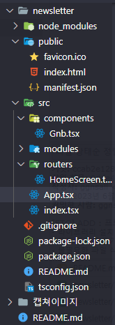

## 프로젝트 실행 가이드

---

```
1. Zip 파일을 해체한다.
2. npm i로 node_modules를 설치한다.
3. npm run start를 통해 실행한다.
4. 모바일 뷰로 확인하면 더 정확히 확인할 수 있습니다.
4-1. 모바일 뷰를 했을 때 가로 스크롤(모바일 뷰 버그)이 생기는 경우 개발자 모드를 켠 
     상태에서 모바일 뷰를 해체하고 새로고침을 한 뒤 다시 모바일 뷰를 실행한다.
4-2. 가로 길이 : 375px, 세로 길이 : 812px을 맞춰서 확인하면 더 정확하다.
5. 만약 429에러가 발생하는 경우 API 요청이 너무 많아 API_key를 변경해야 하므로 다시 시도해보거    나 .env 파일에 새로운 API키를 넣어서 실행하면 된다.
6. 필터링 시 API 헤드라인을 영어로 작성해야 필터링이 가능합니다. => newYork times API라 영어로 검색이 가능함.
```


### 결과

---


### 보완할 점

---

- CRA(Create React App)를 사용하지 않고, Vite를 활용하여 프로젝트 생성

- 커뮤니티 기능 및 더욱 세밀한 필터링 추가 등 추가적인 기능을 도입


## 23.06.06

---

### 1. 프로젝트 셋팅

1. react, typescript 설치

   ```bash
   npx create-react-app my-app --template typescript
   ```

2. 라이브러리 설치

   ```bash
   // router
   npm i react-router-dom@6
   
   // zustand
   npm i zustand
   
   // react-query
   npm i @tanstack/react-query
   
   // emotion
   npm i @emotion/react
   
   // axios
   npm i axios
   
   // datepicker
   npm i @mui/x-date-pickers dayjs @mui/material
   
   // ErrorBoundary
   npm i react-error-boundary
   ```

3. 초기 폴더 구조

   

4. 초기 파일 상태

   - index.tsx

     ```typescript
     import React from "react";
     import ReactDOM from "react-dom/client";
     import App from "./App";
     import { QueryClient, QueryClientProvider } from "@tanstack/react-query";
     
     const queryClient = new QueryClient({
       defaultOptions: {
         queries: {
           retry: false,
           suspense: true,
           useErrorBoundary: true,
           refetchOnWindowFocus: false,
           keepPreviousData: true,
         },
       },
     });
     
     const root = ReactDOM.createRoot(
       document.getElementById("root") as HTMLElement
     );
     root.render(
       // <React.StrictMode>
       <QueryClientProvider client={queryClient}>
         <App />
       </QueryClientProvider>
       // </React.StrictMode>
     );
     
     ```

   - App.tsx

     ```typescript
     import React from "react";
     import { css, Global } from "@emotion/react";
     import { BrowserRouter as Router, Route, Routes } from "react-router-dom";
     
     import Gnb from "./components/Gnb";
     import HomeScreen from "./routers/HomeScreen";
     
     const globalStype = css`
       body {
         margin: 0;
         padding: 0;
         box-sizing: border-box;
       }
     `;
     
     function App() {
       return (
         <>
           <Global styles={globalStype} />
           <Router>
             <Routes>
               {/* 전역 네비게이션 바 */}
               <Route element={<Gnb />}>
                 <Route path="/" element={<HomeScreen />}></Route>
               </Route>
             </Routes>
           </Router>
         </>
       );
     }
     
     export default App;
     
     ```


### 2. 에러 해결

- Emotion "you have tried to stringify object returned from css function" 에러 해결

  ```typescript
  // 아래 코드를 추가해주면 된다.
  /** @jsxImportSource @emotion/react */
  
  // 사용 예시
  /** @jsxImportSource @emotion/react */
  import { css } from "@emotion/react";
  ```

- React-icons 청크 사이즈 줄이기

  - `react-icons`는 icon 종류별로 구분되어 있으며, 종류별로 하나의 js 파일에 아이콘 전체를 포함하고 있다.
  - `@react-icons/all-files` 라이브러리는 아이콘 별로 js 파일을 가지고 있다. 따라서 빌드 시 트리 쉐이킹 방식으로 인해 더 적은 크기의 chunk를 만들게 됩니다.
  - 출처
    - https://eratosthenes.tistory.com/2

  ```bash
  npm i @react-icons/all-files
  ```


## 23.06.07

---

### 1. 구현 내용

- gnb 버튼에 modal 나타내기 구현

- mui datepicker 적용

- gnb 필터 기능 완료

- tap bar 완료

  - CSS 적용
  - navigate 적용
  
  
  

### 2. 에러 해결

- Element implicitly has an 'any' type because expression of type 'string' can't be used to index type 'NationObject'.  No index signature with a parameter of type 'string' was found on type 'NationObject'.
  - **원인**
    - TypeScript는 기본적으로 객체의 프로퍼티를 읽을 때, `string`타입의 key 사용을 허용하지 않는다. 아래의 코드에서 에러가 발생한 이유는 `string literal`타입만 허용되는 곳에 string 타입을 사용했기 때문이다.
  - **참고 블로그** 
    - https://velog.io/@raccoon-ccoder/Error-TypeScript-Element-implicitly-has-an-any-type-because-expression-of-type-string-cant-be-used-to-index

```typescript
// 수정 전
type Nation =
  | "대한민국"
  | "중국"
  | "일본"
  | "미국"
  | "북한"
  | "러시아"
  | "프랑스"
  | "영국";

export type NationObject = Record<Nation, boolean>;


// 수정 후
export type NationObject = {
  [key: string]: boolean;
  대한민국: boolean;
  중국: boolean;
  일본: boolean;
  미국: boolean;
  북한: boolean;
  러시아: boolean;
  프랑스: boolean;
  영국: boolean;
};

```


## 23.06.08

---

### 1. 에러 해결

- 개발자 도구 콘솔에 lockdown-install.js가 뜨는 현상
  - 갑자기 프로젝트를 실행했는데 콘솔에 "lockdown-install.js" warning이 발생하였다.
  - 해결
    - 크롬에서 metamask를 삭제하면 해결되었다.
    - **참고** : https://stackoverflow.com/questions/76393186/what-is-causing-the-warning-removing-intrinsics-arrayprototype-toreversed-in

	### 2. 구현 내용

- text 줄바꿈 없애기

  ```
  white-space: nowrap;
  ```

- News 기사 card CSS 완료

- HomeScreen 컴포넌트 구조 완성


## 23.06.09

---

### 1. 구현 내용

- 무한 스크롤 로직 작성
- 함수형 프로그래밍 무한 스크롤 로직에 적용


## 23.06.10

---

### 1. 에러 해결

- fetchNextPage Type

  - `useInfiniteQuery` 훅의 반환 타입을 나타냅니다. 

  ```
  fetchNextPage: UseInfiniteQueryResult["fetchNextPage"];
  ```

### 2. 구현

- 무한 스크롤 로직 완성

- CSS 글자 수 제한 - 2 줄을 넘어가면 ... 나오게 하기

  ```
  display: -webkit-box;
  -webkit-line-clamp: 2;
  -webkit-box-orient: vertical;
  overflow: hidden;
  text-overflow: ellipsis;
  white-space: normal;
  ```

- 에러 처리 - Too Many Requests : 429

- 기사 클릭 시 링크 처리

  - 참고 : https://blog.hangyeong.com/17

  ```typescript
  1. 현재 페이지에서 URL 열기
  - window.location.href="링크"
  
  2. 새 창에서 URL 열기
  - window.open("링크")
  
  3. 상위 프레임에 부를 때
  - parent.location.href="링크"
  
  4. 팝업
  - OpenWin_variety("링크","창 이름",width,height,출력x좌표,출력y좌표)
  ```


- Gnb 재사용을 위해 코드 수정
- scrap 페이지 완료


## 23.06.13

---

### 1. 구현

- 1280px 크기의 화면 CSS 설정 완료

- ErrorBoundary 적용

  - 코드에서 `fallbackRender` 대신 `fallback`을 사용할 수 있지만, `fallback`은 간단한 예외 대응 컴포넌트만 받으며 에러 정보나 `reset` 함수를 제공하지 않는다. 에러 경계 내에서 `reset` 함수를 특정 액션(예: 버튼 클릭)에 결합시키기 위해서는, `fallbackRender`를 사용하여 에러 정보와 `resetErrorBoundary` 함수에 접근할 수 있어야 합니다.

  ```typescript
  import { ErrorBoundary } from 'react-error-boundary';
  import { useQueryErrorResetBoundary } from 'react-query';
  
  function HomeScreen() {
    const { reset, isReset } = useQueryErrorResetBoundary();
  
    return (
      <>
        <ErrorBoundary
          onReset={reset}
          fallbackRender={({ resetErrorBoundary }) => (
            <ErrorMessage reset={resetErrorBoundary} />
          )}
        >
          <Suspense fallback={<Loading />}>
            <HomeScreenFetcer>
              <HomeScreenListContainer />
            </HomeScreenFetcer>
          </Suspense>
        </ErrorBoundary>
      </>
    );
  }
  
  export default HomeScreen;
  ```

- 스크랩 데이터 필터링 완료
- 스크랩 했을 때 나오는 토스트 구현 완료


